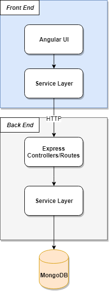

# Project Company Life

This document serves as a general overview of all the topics related to the construction of the project in question.

## General description

The purpose of this project is rather straightforward - create a web application that can serve as a marketing site for a company. The website should contain the following functionality:

- A configurable landing page.
- A section with job ads.
- The ability for users to apply for a job ad.
- An interface for managing all applications by the system administrators.
- A configurable about/contacts page.

For a detailed information about each feature, please refer to the `User stories` section of this document.

## User Stories

This section describes all the required user stories that need to be completed in order for the project to be ready for use.

You can find all the user stories, by navigating to these links:

1. [Landing page](user-stories/landing-page.md)
2. [Job listing](user-stories/job-listing.md)
3. [Job ad details](user-stories/job-ad-details.md)
4. [Contacts page](user-stories/contacts-page.md)
5. [Register new user](user-stories/register-new-user.md)
6. [Login user](user-stories/login-user.md)
7. [Job application](user-stories/job-application.md)
8. [Users administration](user-stories/list-user-admin.md)
9. [Job ads administration](user-stories/job-ads-admin.md)
10. [Create job ad](user-stories/create-job-ad.md)
11. [Job application administration](user-stories/job-applications-admin.md)
12. [Links administration](user-stories/links-admin.md)
13. [Create link](user-stories/create-link-admin.md)
14. [Contact details administration](user-stories/contacts-admin.md)
15. [Create contact detail](user-stories/create-contact-admin.md)
16. [Access level](user-stories/access-level.md)

## Technical Stack

The core technical stack for this application should be the MEAN stack. You should use Angular 5/6 for the UI and Express, Node and Database of your choice.

## Proposed Architecture

This following section describes a proposed architecture that may or may not be used by the development team.

The suggested architecture is composed of the following sub-projects:

- Front-End - the purpose of this project is to visualize our data and take user input while transmitting it to the back-end. This project contains the following sub-components:
        - Angular UI - this component deals ONLY with the visualization of data
        - Service Layer - this is the home of all our data communication logic, sending POST/GET/PUT/DELETE requests to the back-end should be done through here.

- Back-End - the purpose of this project is to abstract any communication with the data source and provide a clean Web API interface for our UI to consume. This project contains the following sub-components:
        - Express Controllers/Routes layer - this component houses all the express routing logic and exposes a valid REST CRUD API for our front-end to consume.
        - Service Layer - this is the home of all our data storage and validation logic. If we want to store something in our database, we should go through here.

- Data storage - this is the persistent storage for our system.

## General pointers

Authors think bellow recommendations may be of use to the developers of this system.

- It is highly recommended to use Angular Material([https://material.angular.io/](https://material.angular.io/)) components and NOT write everything from scratch.
- The wireframe images are NOT to be taken as 100% accurate - use imagination and common sense. 

## Challenges

If you manage to complete the whole project before the deadline, here are some additional challenges:

- Implement 3rd party authentication using Facebook, Tweeter, Github, and Google.
- Make a new administration for the Job Category and use it to dynamically create job categories.
- Generate a test coverage report for the application.
