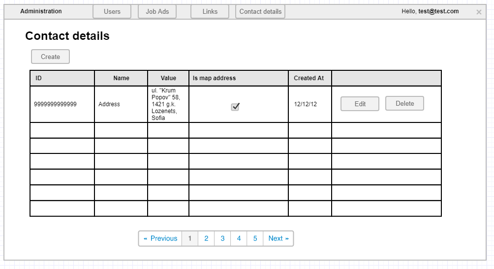

# List contacts details administration

## User Story

As an administrator
I want to view, create, edit, and delete contact details
So that I can manage the company's contact information displayed on the contacts page.

## Description

This page allows administrators to view all the contact details in the application, add new ones and delete/edit existing ones.

## User Type

- Administrator

## Prerequisites

- User must be logged in as administrator
- Contact details database table must exist

## Page Wireframe

## Business Rules

- Only administrators can access this page
- Paging is shown when there are more than 10 contact details
- All columns except action columns are sortable
- Delete operations require confirmation

## Acceptance Criteria

1. When an administrator clicks on the Contact details button in the administration part of the application, the administrator is redirected to the Contact details administration page.
1. If there are more than 10 contact details in the application, a paging mechanism is shown.
1. The administrator can sort by each column (except the action columns).
1. If there are no contact details in the application, a `No data available` message should be present.
1. If the administrator clicks the `Create` button he/she is redirected to the Create Contact details administration page.
1. If the administrator clicks the `Edit` button, he/she is redirected to the Create contact details administration page but with already filled details.
1. If the administrator clicks the `Delete` button, an `Are you sure` confirmation window pops up.
1. If the administrator clicks `Yes` in the delete confirmation window, the row entry is deleted from the database and the grid is updated immediately.
1. If the administrator clicks `Cancel` in the delete confirmation window, the window closes and nothing else happens.

## Error Scenarios

- No contact details available → Show "No data available" message
- Delete confirmation cancelled → No action taken
- Network error during delete → Show error message

## Test Scenarios

1. Happy path: Administrator views, creates, edits, and deletes contact details successfully
2. Empty state: No contact details, shows appropriate message
3. Paging: More than 10 contact details, paging is displayed
4. Delete cancellation: Administrator cancels delete operation

## Related Stories

- [Create contact detail](create-contact-admin.md)
- [Contacts page](contacts-page.md)
