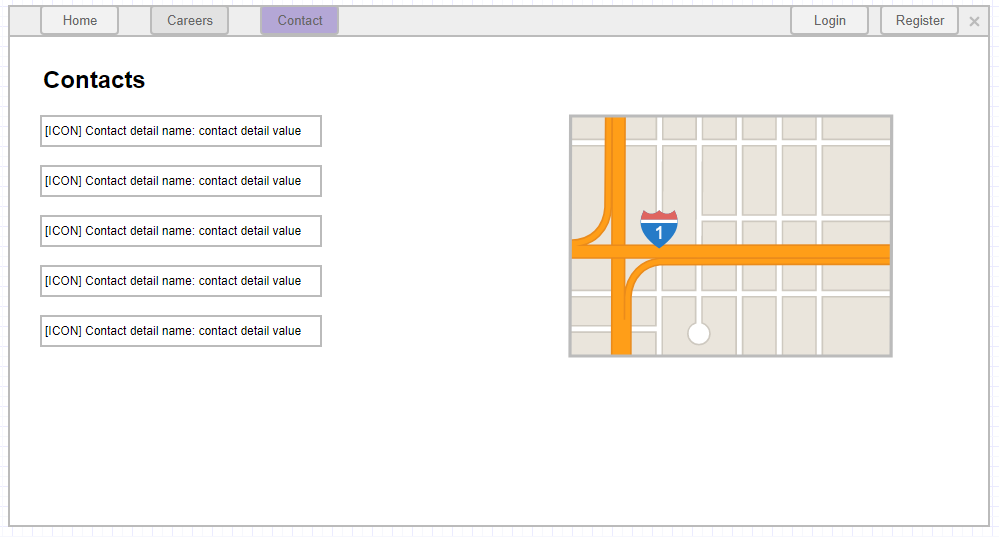

# Contacts page

## User Story

As a user
I want to view the company's contact information and location on a map
So that I can easily find and contact the company.

## Description

This page provides basic contact details to the user and offers a Google maps integration for easy address display.

## User Type

- Anonymous
- Logged In
- Administrator

## Prerequisites

- Contact details must be configured in the administration
- Google Maps API must be configured

## Page Wireframe

## Business Rules

- Contact details are loaded dynamically from the database
- Only the first contact detail with isPrimaryAddress flag set to true is used for map display
- If no primary address is set, default map position is Sofia
- Multiple primary addresses are not supported (only first one is used)

## Acceptance Criteria

1. When a user clicks on the Contacts button in the navigation bar, he/she should be redirected to the Contacts page.
1. The user should see a list of contact details for the company.
1. The contact details list should be dynamic and should be loaded from the database.
1. A contact detail has a name, a value, an isPrimaryAddress flag and an icon.
1. The user should see a Google maps with the location of the company. The address should be extracted as the value of the first contacts details entry that has the isPrimaryAddress flag set to true. If there is no primary address set, just show the map and set the default display position to Sofia.
1. If there are multiple contacts details entries that have the isPrimaryAddress flag set to true, take only the first and ignore the rest.

## Error Scenarios

- No contact details available → Show empty state or default message
- Google Maps API unavailable → Show error message or fallback
- Invalid address format → Use default location (Sofia)

## Test Scenarios

1. Happy path: User views contact details and map successfully
2. No primary address: Map shows default location (Sofia)
3. Multiple primary addresses: Only first one is used
4. No contact details: Appropriate empty state is shown

## Related Stories

- [Contact details administration](contacts-admin.md)
- [Create contact detail](create-contact-admin.md)
