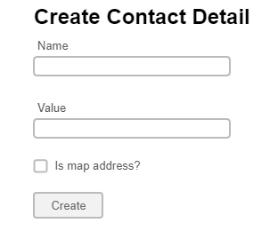

# Create/edit contacts details administration

This page allows administrators to create or edit Contact details. 

## Page wireframe

## Acceptance criteria

1. When a user clicks on the Create button in the Contact details administration he/she is redirected to the Contact details create administration page.
2. The name of the contact detail must be between 2 and 128 characters. If that is not the case the user will get an error message.
3. The value of the contact detail must be between 2 and 1024 characters. If that is not the case the user will get an error message.
4. If the users mark the `Is map address?` checkbox an integrated Google map is shown in the Contacts page with the value of the current contact detail for an address.
5. When the user clicks the `Create` button and all the form fields are valid, a new contact detail is created, which has its CreatedAt value set to the moment of the link creation.
6. If there are any invalid fields in the form, the `Create/Edit` button should be disabled.
7. After the link is created the user is redirected to the Links administration page.
