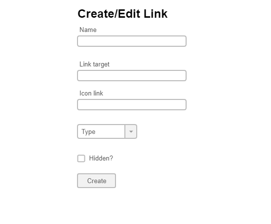

# Create/edit link administration

This page allows administrators to create or edit links.

**Note:** If you wish you can create this form as a modal and not as a seprate page.

## Page wireframe

## Acceptance criteria

1. When a administrator clicks on the Create button in the Links administration he/she is redirected to the Link create administration page.
2. The link must have a name that is between 3 and 128 characters. If that is not the case the administrator will get an error message.
3. The link target field must have a value. If that is not the case the administrator will get an error message.
4. The icon link field must have a value. If that is not the case the administrator will get an error message.
5. The administrator must choose a type for the link - the predefined types are action link and social link. The default value in the drop-down is a social link.
6. If the administrator marks the `Hidden?` option, the link should not be displayed in the UI.
7. If there are any invalid fields in the form, the `Create/Edit` button should be disabled.
8. When the administrator clicks the `Create` button and all the form fields are valid, a new link is created, which has its CreatedAt value set to the moment of the link creation.
9. After the link is created the administrator is redirected to the Links administration page.
