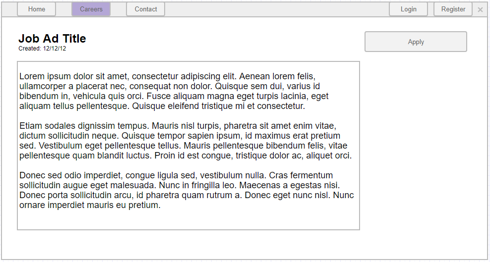

# Job ad details

This page gives the user more details about a job ad and allows him/her to apply for that position.

## Page wireframe

## Acceptance criteria

1. When a user clicks on a job ad, he/she should be redirected to the Job ad details page.
1. The user should see the Job title when the ad was created and the detailed description of the ad.
1. The user should be able to click the apply button.
1. After clicking on the apply button if the user is logged in, he/she should be redirected to the Job application page.
1. After clicking on the apply button if the user is NOT logged in, he/she should be redirected to the login registration page. After the authentication process is complete, he/she should be redirected to the job application page.
1. If the job ad that the user is trying to access is closed, he should be redirected to the Home page.
1. If an administrator is trying to access a closed job ad, this should be possible.
1. If the user is an administrator, he has an additional button `Show all applications`, that redirects him to the view job applications administration.
