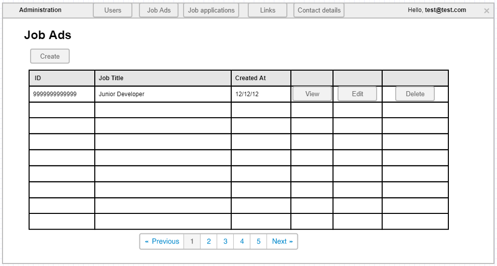

# List job ads administration

This page allows administrators to view all the job ads in the application, add new ones and delete/edit existing ones.

## Page wireframe

## Acceptance criteria

1. When a administrator clicks on the Job Ads button in the administration part of the application he is redirected to the Job ads administration page.
1. If there are more than 10 job ads in the application, a paging mechanism is shown.
1. The administrator can sort by each column (except the action columns).
1. If there are no job ads in the application, a `No data available` message should be present.
1. If the administrator clicks the `Create` button he/she is redirected to the Create Job ad administration page.
1. If the administrator clicks the `View` button, he/she is redirected to the Job ad details page.
1. If the administrator clicks the `Edit` button, he/she is redirected to the Create Job ad administration page but with already filled details.
1. If the administrator clicks the `delete` button, a `Are you sure` confirmation window pops up.
1. If the administrator clicks `Yes` in the delete confirmation window, the row entry is deleted from the database and the grid is updated immediately.
1. If the administrator clicks `Cancel` in the delete confirmation window, the window closes and nothing else happens.
