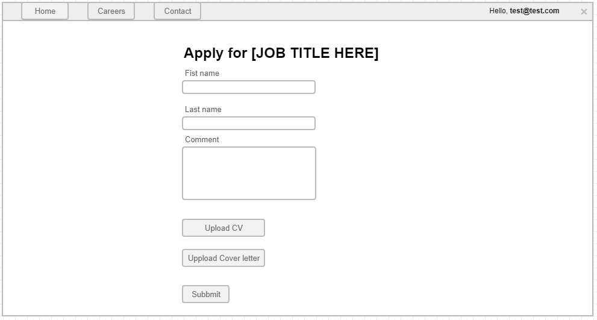

# Job application

This page allows a logged in user to apply for a job ad.

## Page wireframe

## Acceptance criteria

1. When a user clicks on the Apply button in a job ad and if he/she is logged in, he/she is redirected to the Job application page.
1. The user MUST enter their first name.
1. A valid first name is considered a string, containing only alphabetical characters, and that has a length between 3 and 100 characters.
1. The user MUST enter a last name.
1. A valid last name is considered a string, containing only alphabetical characters, and that has a length between 3 and 100 characters.
1. The user MAY enter an additional comment.
1. The additional comment must be at most - 1024 symbols.
1. The user MUST upload their CV.
1. The maximum size of a CV document is 16 MB.
1. The accepted file formats for CV are `.pdf`,`.docx`, `.doc`
1. The user MAY upload a cover letter.
1. The maximum size of a cover letter document is 16 MB.
1. The accepted file formats for cover letter are `.pdf`,`.docx`, `.doc`
1. If the user does not meet any of the required criteria and tries to submit the job application - an error message is displayed.
1. The `Submit` button should be disabled if there are any invalid fields in the form.
