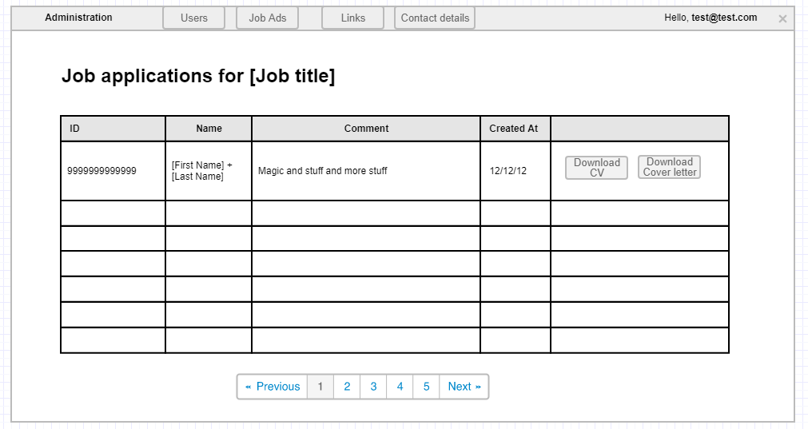

# List job applications administration

## User Story

As an administrator
I want to view job applications for a specific job ad
So that I can review and manage applications for that position.

## Description

This page allows administrators to view all the job applications for a specific job ad.

## User Type

- Administrator

## Prerequisites

- User must be logged in as administrator
- Job ad must exist
- Job applications must exist for the job ad

## Page Wireframe

## Business Rules

- Only administrators can access this page
- Only shows applications for the specific job ad
- Paging is shown when there are more than 10 applications
- All columns except action columns are sortable
- Name column contains first and last name
- Email column opens default mail client when clicked

## Acceptance Criteria

1. When an administrator clicks on the Applications button in a job ad he/she is redirected to the Job Applications administration page.
1. The administrator sees ONLY the job applications for a specific ad.
1. If there are more than 10 job applications for the job ad, a paging mechanism is shown.
1. The administrator can sort by each column (except the action columns).
1. If the administrator clicks the `Download CV` button, the uploaded CV file for that application is downloaded.
1. If the administrator clicks the `Download Cover Letter` button, the uploaded Cover letter file for that application is downloaded.
1. The Name column of the grid must contain the first and the last name specified in the application.
1. There must be an additional column for the email of the user that sent the application (not shown in the wireframe). When the administrator clicks the email, it opens the default mail client installed on that machine.

## Error Scenarios

- No applications for job ad → Show appropriate message
- CV file not found → Show error message
- Cover letter file not found → Show error message (if cover letter was uploaded)
- Network error during download → Show error message

## Test Scenarios

1. Happy path: Administrator views applications and downloads files successfully
2. Empty state: No applications for job ad, shows appropriate message
3. Paging: More than 10 applications, paging is displayed
4. Download CV: Administrator downloads CV file
5. Download cover letter: Administrator downloads cover letter file
6. Email click: Administrator clicks email, mail client opens

## Related Stories

- [Job ad details](job-ad-details.md)
- [Job application](job-application.md)
- [Job ads administration](job-ads-admin.md)
