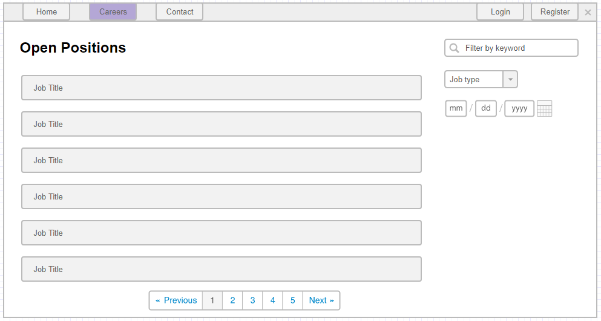

# Job listing

## User Story

As a user
I want to browse and filter job openings
So that I can find positions that match my interests and qualifications.

## Description

This page allows potential applicants to browse open positions in the company. Additionally, the user can filter the job ads by some set of criteria.

## User Type

- Anonymous
- Logged In
- Administrator

## Prerequisites

- Job ads must exist in the system
- Navigation must include Careers button

## Page Wireframe

## Business Rules

- Displays 10 active positions per page
- Paging is shown when there are more than 10 active positions
- Regular users cannot view inactive job ads
- Administrators can view inactive job ads
- Filters can be combined (search term, job type, create after date)
- Search uses "contains" logic (no complex algorithms)
- Reset filters navigates to first page

## Business Rules - Filtering

- Search term: Searches in title and description (contains logic)
- Job type: Filter by category (IT, Sales, Marketing, Operations, Other)
- Create after date: Filter by creation date
- All filters work together (AND logic)

## Acceptance Criteria

1. When a user clicks on the Careers button in the navigation he/she should be redirected to the Job Listings page.
1. A job ad should have a title, description, type (IT, Sales, Marketing, etc.), creation date, status (Active, Inactive).
1. The page should display a list of 10 active positions + paging if there are more than 10 active positions.
1. The user should be able to filter the jobs by a search term. The search should be using the title and the description of the job ad. *Hint: Use contains - no complex algorithms are required.*
1. The user should be able to filter the job ads by job type.
1. The user should be able to filter the jobs by a create after date filter.
1. All the filters should be able to work together. Example: I should be able to search for jobs that have the keyword `TypeScript`, are of job type `IT` and are created after the Sunday of last week.
1. If the user clicks on the paging he/she should be shown the next 10 job ads.
1. If the user clicks the reset all filter button, all filters should be removed and the user should be navigated to the first page of the grid.
1. When a user clicks on a job ad, he/she should be redirected to the Job ad details page.
1. The user should NOT be able to view inactive job ads.
1. The administrator should be able to view inactive job ads.
1. If there are no job ads, the paged list is replaced with the message `There are no active positions - please try later`.

## Error Scenarios

- No job ads available → Show "There are no active positions - please try later" message
- No results after filtering → Show appropriate message
- Network error during load → Show error message

## Test Scenarios

1. Happy path: User browses job listings and applies filters successfully
2. Empty state: No job ads, shows appropriate message
3. Paging: More than 10 job ads, paging is displayed
4. Filtering: User applies multiple filters, sees filtered results
5. Reset filters: User resets filters, returns to first page
6. Inactive ads: Regular user cannot see inactive ads, administrator can
7. Search: User searches for keyword, sees matching results

## Related Stories

- [Job ad details](job-ad-details.md)
- [Job ads administration](job-ads-admin.md)
- [Create job ad](create-job-ad.md)
