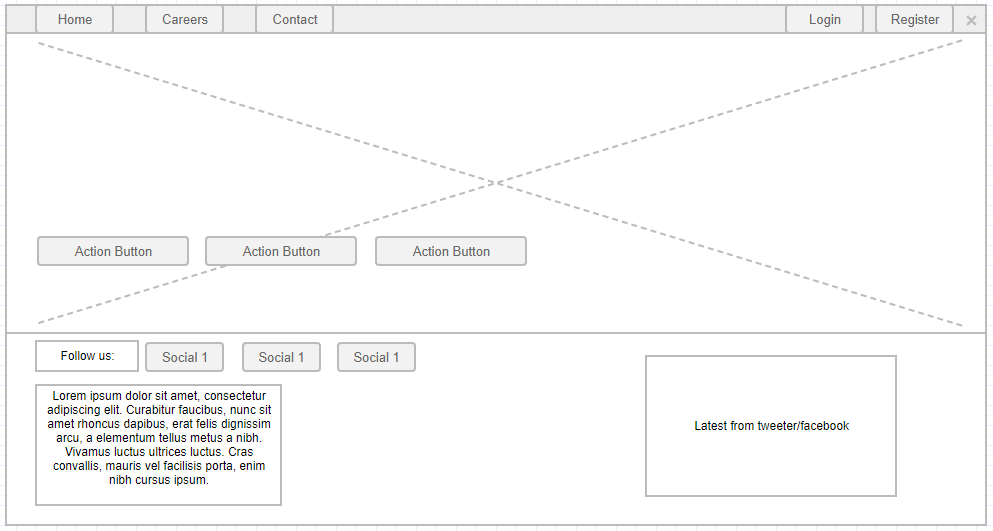

# Landing page

This page is the default home page for our application. It displays some basic information:

- Dynamic list of action buttons.
- Dynamic list of social buttons.
- A configurable free text.
- Configurable background image.
- A list of the latest tweets/facebook posts.

## Page wireframe

## Acceptance criteria

1. When navigating to the app root we should see the Home page.
2. When clicking on the home button from the navigation bar, the home page should be opened.
3. The image background for the home page should be configurable via the project environment variables or a JSON file configuration.
4. When a user clicks an action button he should be redirected to the respective web address.
5. The dynamic action button list should be customizable from the administration.
6. The dynamic social button list should be customizable from the administration.
7. A social button should have an icon and a link.
8. When a user clicks on a social button, he should be redirected to the respective URL link.
9. The free text under the social button list should be configurable via the project environment variables or a JSON file configuration.
10. The home page should display the latest twitter or facebook items from the organization twitter/facebook page.
11. The organization twitter/facebook page should be configurable via the project environment variables or a JSON file configuration.
