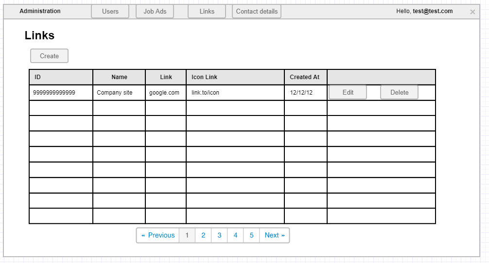

# List links administration

## User Story

As an administrator
I want to view, create, edit, and delete links
So that I can manage action buttons and social buttons displayed on the landing page.

## Description

This page allows administrators to view all the links in the application, add new ones and delete/edit existing ones. Links are displayed on the landing page either as Action Buttons (Action links) or as Social Buttons (Social links).

## User Type

- Administrator

## Prerequisites

- User must be logged in as administrator
- Links database table must exist

## Page Wireframe

## Business Rules

- Only administrators can access this page
- Paging is shown when there are more than 10 links
- All columns except action columns are sortable
- Delete operations require confirmation
- Link type column must be displayed (not shown in wireframe)

## Acceptance Criteria

1. When an administrator clicks on the Links button in the administration part of the application he/she is redirected to the Links administration page.
1. If there are more than 10 links in the application, a paging mechanism is shown.
1. The administrator can sort by each column (except the action columns).
1. If there are no Links in the application, a `No data available` message should be present.
1. If the administrator clicks the `Create` button he/she is redirected to the Create Link administration page.
1. If the administrator clicks the `Edit` button, he/she is redirected to the Create Link administration page but with already filled details.
1. If the administrator clicks the `Delete` button, a `Are you sure` confirmation window pops up.
1. If the administrator clicks `Yes` in the delete confirmation window, the row entry is deleted from the database and the grid is updated immediately.
1. If the administrator clicks `Cancel` in the delete confirmation window, the window closes and nothing else happens.
1. There must be an additional column for the link type (not shown in the wireframe).

## Error Scenarios

- No links available → Show "No data available" message
- Delete confirmation cancelled → No action taken
- Network error during delete → Show error message

## Test Scenarios

1. Happy path: Administrator views, creates, edits, and deletes links successfully
2. Empty state: No links, shows appropriate message
3. Paging: More than 10 links, paging is displayed
4. Delete cancellation: Administrator cancels delete operation
5. Link type display: Link type column is visible

## Related Stories

- [Create link](create-link-admin.md)
- [Landing page](landing-page.md)
