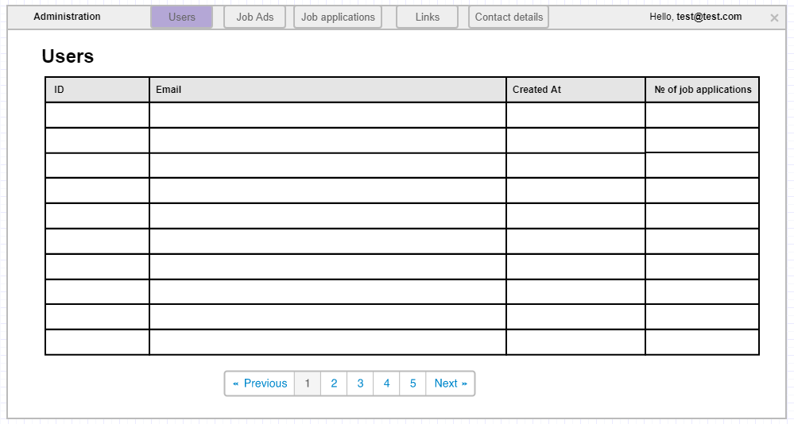

# List users administration

This page allows administrators to view all the registered users in the application.

## Page wireframe

## Acceptance criteria

1. When an administrator clicks on the Users button in the administration part of the application, he/she is redirected to the Users administration page.
1. All the users are displayed in a grid, and each user must have a unique database id, his/her email, when he/she was registered and how many jobs he/she has applied for.
1. If there are more than 10 users in the application, a paging mechanism is shown.
1. The administrator can sort by each column.
1. If there are no users in the application, a `No data available` message should be present.
