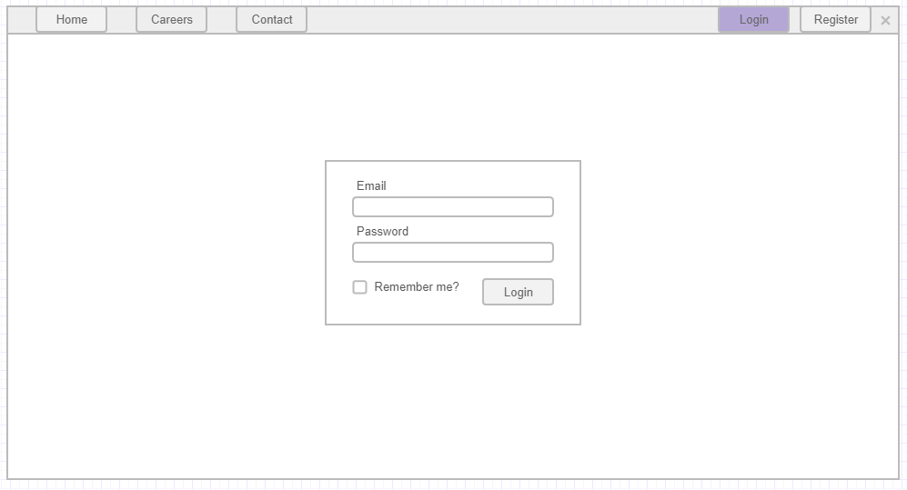

# Login user

This page allows the user to login an existing user in the application.

## Page wireframe

## Acceptance criteria

1. When a user clicks on the Login button in the navigation he should be redirected to the Register user page.
2. If the user enters an invalid email, there should be an error message. (Example of invalid emails: aaaaaa, 99999, ____).
3. The password field must have a value before the form is submitted.
4. The `Login` button should be disabled if there are invalid fields in the login form.
5. If the user clicks `Login` button, all the fields are valid, BUT his login information is invalid, he/she should be presented with an error message.
6. If the user clicks `Login` button, all the fields are valid and his login information is valid, he/she should be redirected to the home page and login/register buttons in the nav bar should be replaced with `Hello {email}` message.
7. If the user checks the `Remember me?` checkbox, he/she should remain logged in even if the closes the browser.