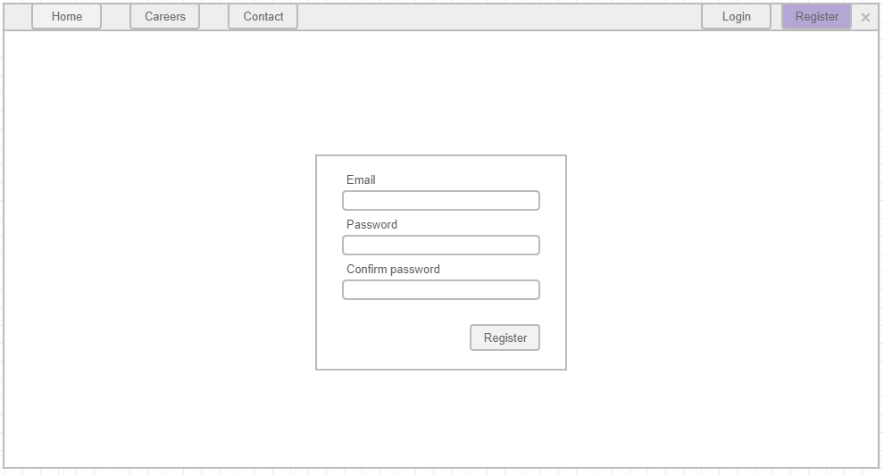

# Register new user

This page allows the user to register a new user in the application.

## Page wireframe

## Acceptance criteria

1. When a user clicks on the Register button in the navigation he should be redirected to the Register user page.
2. If the user enters an invalid email, there should be an error message. (Example of invalid emails: aaaaaa, 99999, ____).
3. If the email already exists in the database the user should receive an error message.
4. If the user enters different values the `Password` and `Confirm password` fields, he should receive an error.
5. If the user enters a password that does not have a minimum of 8 characters, at least 1 uppercase letter, 1 digit, and 1 special symbol, he should receive an error.
6. If the user enters more than 256 symbols in the password field he should receive an error.
7. If the user enters an email, that has more than 1024 characters, he should receive an error.
8. The `Register` button, should be inactive, before every field in the register for is valid.
9. If the user clicks the Register button when all the fields are valid, he/she should be redirected to the home page and login/register buttons in the nav bar should be replaced with `Hello {email}` message.
10. If the user is already signed in, he should not be able to access the Register user page.
